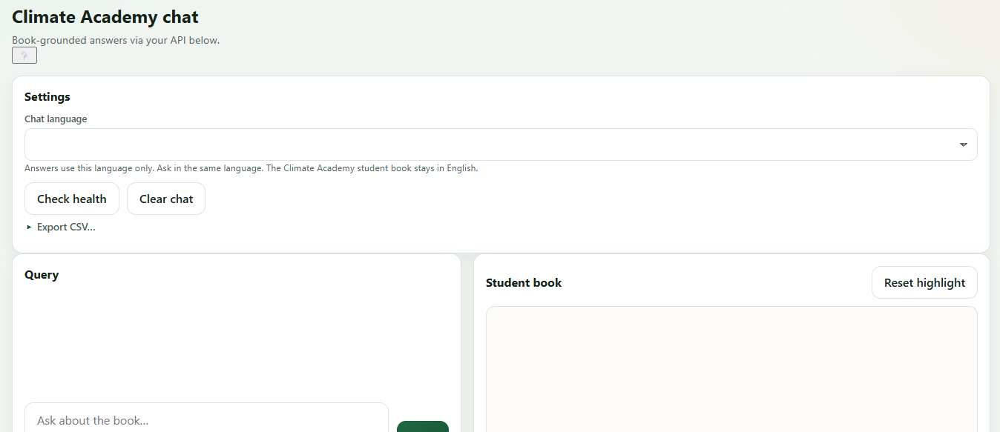
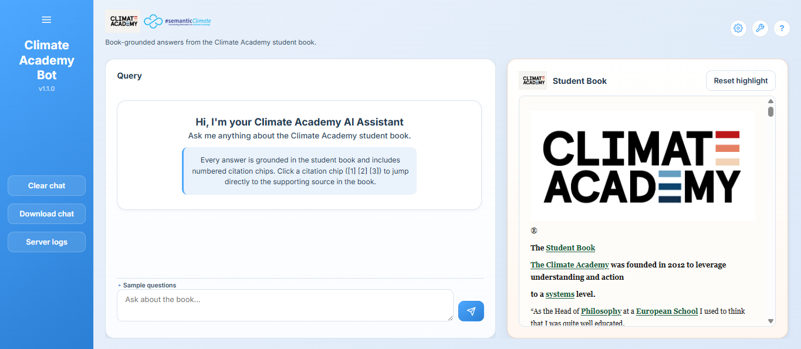

## June 3 — Planning the Climate Academy Frontend Revamp

Dr. Gitanjali Yadav asked me to redesign the Cloudflare-hosted frontend for the
Climate Academy chatbot. While the existing interface was functional, the goal
was to create a more visually appealing and branded user experience that better
reflected the Climate Academy project.

Before making any code changes, I began planning the redesign by analyzing the
current interface and sketching a new layout. My focus was on improving
navigation, reducing visual clutter, and making the chatbot's key features more
discoverable.

### Initial Design

**Base Interface**

Characteristics:
- Plain white/cream interface with no dedicated branding area
- Settings displayed across the top of the page
- Functional layout but minimal visual hierarchy

**Planned Redesign**

Planned improvements:
- Introduce a dedicated **sidebar** containing Climate Academy branding, version
  information, and frequently used actions
- Move utility functions (Clear Chat, Download Chat, Server Logs) into the
  sidebar to free up the main workspace
- Add a more welcoming introduction that explains how citations work
- Improve the Student Book panel with clearer branding and a cleaner layout
- Make citation chips more prominent so users can easily navigate to supporting
  passages in the Student Book

### Design Goals

The planned redesign focuses on:
- Improving the overall visual identity of the application
- Reducing clutter by reorganizing settings and utility actions
- Making citation-based navigation more intuitive for new users
- Creating a cleaner and more modern user experience while preserving the
  existing functionality

### Next Steps

The design has been planned and documented. The next stage will involve
implementing the new frontend layout, integrating the sidebar, refining the
responsive design, and validating that all existing chatbot functionality
continues to work correctly after the redesign.