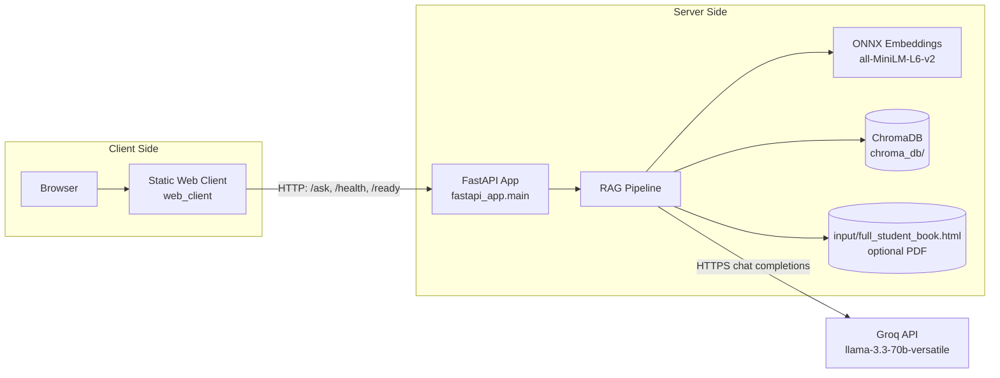
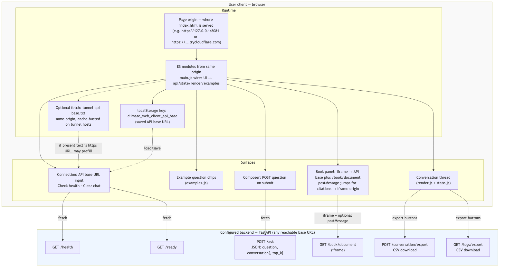
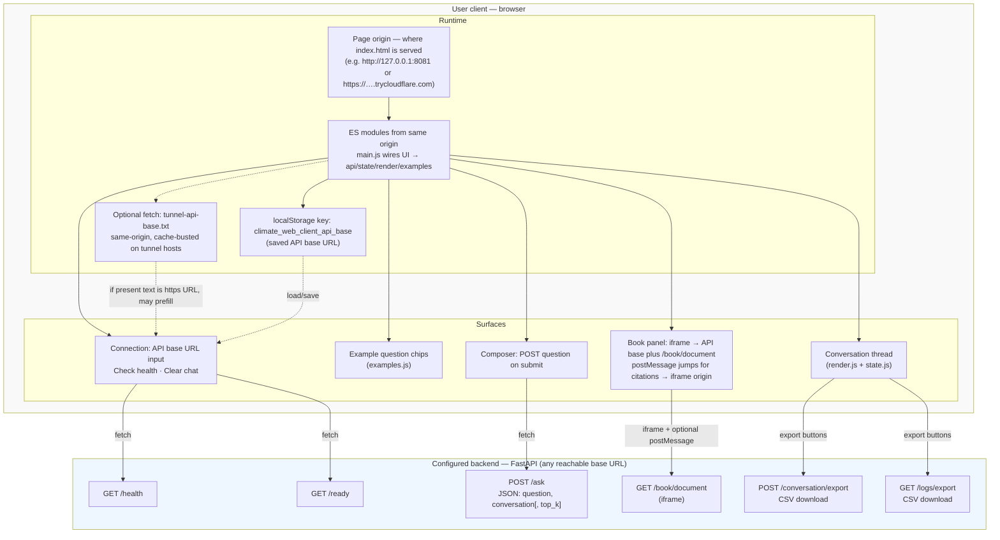

# Client and server architecture

Source diagrams live as Mermaid in `docs/architecture/*.mmd` (kept in sync with the blocks below). **PNG** and **SVG** exports for GitHub viewers and embedding are beside them: regenerate with `bash docs/architecture/render-diagrams.sh` (requires Node and downloads `@mermaid-js/mermaid-cli`, which renders via headless Chromium). Graphviz **`dot`** reads the DOT language, not Mermaid, so those exports are produced with the Mermaid CLI rather than Graphviz directly.

This diagram shows the end-to-end architecture across the browser client, web UI, API server, retrieval stack, and external LLM provider.

| Static export | PNG | SVG |
| --- | --- | --- |
| Overview | [`architecture-overview.png`](architecture/architecture-overview.png) | [`architecture-overview.svg`](architecture/architecture-overview.svg) |
| User client detail | [`architecture-user-client.png`](architecture/architecture-user-client.png) | [`architecture-user-client.svg`](architecture/architecture-user-client.svg) |

## User client (browser) detail

This expands the static `web_client/` layer: UI surfaces, modules, persisted API base URL, optional tunnel hint file, and HTTP endpoints used from the configured API base.

