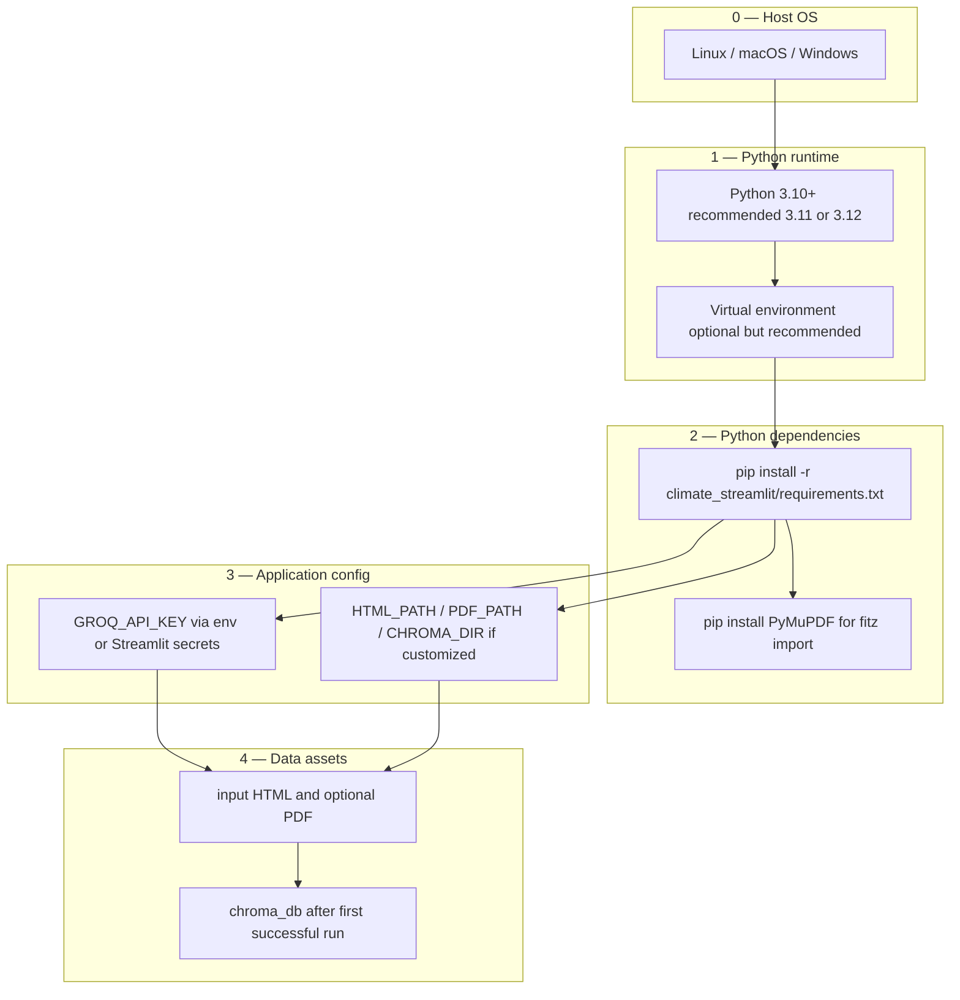

# Installation architecture

How the chatbot should be provisioned across environments: what gets installed where, how configuration is layered, and what must persist across upgrades.

## Environments

| Tier | Typical use | Characteristics |
|------|-------------|-------------------|
| **Developer workstation** | Local iteration | Python venv, `streamlit run app.py`, local `chroma_db/`, secrets in `.streamlit/secrets.toml` or shell env |
| **Shared server / VM** | Team or classroom | One service user, systemd (or similar) supervision, reverse proxy + TLS, secrets from host env or vault |
| **Container** | Repeatable deploy | Image with app + deps; mount `input/` and `chroma_db/` as volumes; inject `GROQ_API_KEY` at runtime |
| **Managed PaaS** | Low-ops hosting | Must support long-running web process, writable disk for `chroma_db/`, and outbound HTTPS to Groq |

This repository does not ship Docker or Terraform; the patterns above are the natural fits for the current codebase.

## Installation layers



1. **Host**: OS with enough disk for models/index and outbound HTTPS.
2. **Python**: Match project expectation (see `climate_streamlit/README.md`); isolate with a venv.
3. **Dependencies**: `requirements.txt` plus **`pymupdf`** (explicit in README; required for PDF features).
4. **Configuration**: `GROQ_API_KEY` mandatory for LLM replies; paths only if defaults are wrong for your layout.
5. **Data**: place book assets under `input/`; allow first-run build of `chroma_db/`.

## Repository layout contract

Installations should preserve this mental model:

```text
chatbot/                         # ROOT_DIR — persistent volume root for prod
  climate_streamlit/
    app.py
    html_sectioning.py
    requirements.txt
    .streamlit/                  # config + secrets.toml (local dev); avoid committing secrets
  input/
    full_student_book.html       # required
    2025_10/climate_academy_book.pdf   # optional
  chroma_db/                     # created at runtime — back up if you rely on stable indices
```

Code resolves `ROOT_DIR` as the parent of `climate_streamlit/`, so the app expects `input/` and default `chroma_db/` beside `climate_streamlit/`, not inside it.

## Provisioning checklist

**One-time:**

- Install Python **3.10+** (3.11/3.12 recommended).
- Clone or copy this repository maintaining the layout above.
- Create a venv, upgrade `pip`, run `pip install -r climate_streamlit/requirements.txt` and `pip install pymupdf`.
- Obtain a Groq API key and configure `GROQ_API_KEY` (environment variable preferred for servers).

**Assets:**

- Ensure `input/full_student_book.html` exists.
- Optionally add the PDF path used by default or update `PDF_PATH`.

**First run:**

- From `climate_streamlit/`: `streamlit run app.py`.
- Expect **longer startup** while embeddings and Chroma indexing run; subsequent starts reuse `chroma_db/`.

## Persistence and backups

| Artifact | Persist? | Notes |
|----------|-----------|-------|
| `chroma_db/` | Yes | Rebuild by deleting folder; CPU cost on regenerate |
| `input/` | Yes | Source of truth for book content |
| `.streamlit/secrets.toml` | Optional | Prefer env-based secrets on shared hosts |
| Python venv / site-packages | Rebuild OK | Derived from `requirements.txt` |

## Upgrades

1. Pull or deploy new application code under `climate_streamlit/`.
2. Re-run dependency install against updated `requirements.txt`.
3. If chunking logic, collection name, or source HTML changes materially, **delete `chroma_db/`** (or rename collection in code) to avoid stale retrieval, then restart once.

## Operational command (baseline)

Production-like hosts usually wrap:

```bash
cd /path/to/chatbot/climate_streamlit
source .venv/bin/activate   # if using venv
export GROQ_API_KEY="..."   # or use service env file
streamlit run app.py --server.port 8501 --server.address 0.0.0.0
```

Use your platform’s equivalent for binding address, TLS (often via reverse proxy), logging, and restart policy.

For day-to-day developer setup, follow `climate_streamlit/README.md` step by step.
