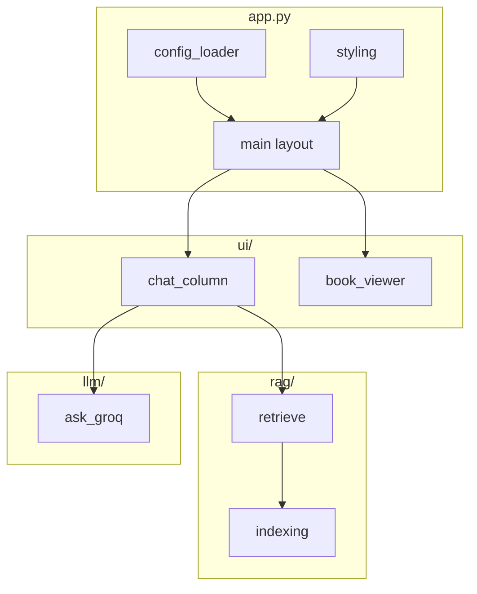

# Refactor plan: `climate_streamlit/app.py`

Goals: align with the project style guide (external CSS/config, no monolithic strings), make the app maintainable in **~one-page units**, and preserve behavior during incremental extraction.

**Current size:** ~1.3k lines in a single file, including ~200 lines of Streamlit chrome CSS, embedded iframe book CSS + JS, path/model constants, a long `SYSTEM_PROMPT`, and mixed UI + RAG + LLM + PDF logic.

---

## 1. What to extract first (styles and configuration)

### 1.1 Streamlit application CSS

**Today:** `st.markdown("""<style>…</style>""")` from approximately lines 73–277.

**Target:** `climate_streamlit/assets/app_streamlit.css` (or `static/css/app.css`).

**Load pattern:** a small helper, e.g. `inject_stylesheet(path: Path) -> None`, that reads UTF-8 text and wraps it in `<style>...</style>` once at startup (after `set_page_config`). Keeps `app.py` to one call like `apply_streamlit_theme()`.

### 1.2 Book iframe assets (annotated HTML injection)

**Today:** Inside `get_annotated_book_html()` — `highlight_css` (~60 lines) and `jump_script` (~55 lines) as triple-quoted strings.

**Target:**

- `climate_streamlit/assets/book_iframe_highlight.css`
- `climate_streamlit/assets/book_iframe_jump.js` (optional: minify later; start readable)

**Injection:** read files relative to package dir (`Path(__file__).resolve().parent`), insert into HTML as today (`</head>` / `</body>`). Optionally keep a tiny Python function `inject_book_assets(html: str, paths: BookAssetPaths) -> str` in a dedicated module.

**Why separate from Streamlit CSS:** different context (iframe document vs Streamlit shell), different lifecycle (cached HTML build vs per-session UI).

### 1.3 Configuration (paths, numbers, model IDs, UI copy)

**Today:** Module-level constants (`HTML_PATH`, `TOP_K`, `GROQ_MODEL`, `BOOK_VIEWER_HEIGHT`, `history` height formula literals, `retrieve` distance threshold `1.5`, Groq `max_tokens` / `temperature`, history window `8`, etc.) and **user-visible** strings scattered in the main flow.

**Target:** `climate_streamlit/config/app.defaults.toml` (or `yaml`) as the **single defaults** file checked into the repo. Structure sketch:

```toml
[paths]
# Resolved against repo root; overrides optional via env later
html = "input/full_student_book.html"
pdf = "input/2025_10/climate_academy_book.pdf"
chroma_dir = "chroma_db"

[chroma]
collection_name = "climate_academy_paragraphs_v2"

[retrieval]
top_k = 14
max_distance = 1.5

[llm]
model = "llama-3.3-70b-versatile"
max_tokens = 4096
temperature = 0.15
history_turns = 8

[ui]
page_title = "Climate Academy Chatbot"
page_icon = "🌍"
book_viewer_height = 760
chat_history = { min_height = 360, max_height = 680, base = 170, per_message = 105 }

[prompts]
system_prompt_file = "prompts/system_rag_json.txt"
```

**Load:** one module `config.py` (or `settings.py`) that:

- Resolves `ROOT_DIR` from `Path(__file__)`.
- Loads TOML with `tomllib` (stdlib 3.11+) or add `pyyaml` only if you prefer YAML.
- Leaves **secrets** (`GROQ_API_KEY`) in `st.secrets` / env only — not in this file.

**Prompts:** `climate_streamlit/prompts/system_rag_json.txt` with a `{context}` placeholder for `.format(context=...)`. Keeps the large system instruction out of Python.

**Optional second phase:** `ui_strings.toml` for panel titles, disclaimer, chat placeholder, button labels — reduces remaining literals in layout code.

---

## 2. Proposed package layout (after config + CSS)

Logical boundaries already present in `app.py`; map them to files:

```text
climate_streamlit/
  app.py                      # Thin entry: set_page_config, inject CSS, wire session, call layout
  config/
    __init__.py               # empty per amilib convention, or omit package if flat
  config_loader.py            # load TOML, expose AppSettings dataclass / SimpleNamespace
  assets/
    app_streamlit.css
    book_iframe_highlight.css
    book_iframe_jump.js
  prompts/
    system_rag_json.txt
  styling.py                  # apply_streamlit_css(); optional inject_book_assets() reader helpers
  rag/
    indexing.py               # build_knowledge_base, load_embedder, HTML_PATH resolution
    retrieve.py               # retrieve()
    sources.py                # build_sources()
  llm/
    groq_client.py            # load_groq()
    prompts.py                # format system prompt from file
    ask.py                    # ask_groq + parsing helpers (_parse_llm_json_blob …)
    parsing.py                # JSON normalize / fallback messages (split ask.py if still long)
  pdf/
    index.py                  # load_pdf_index, map_chunks_to_pdf, keyword helpers
    viewer.py                 # render_pdf_viewer, load_pdf_data_uri
  ui/
    book_viewer.py            # render_book_viewer (iframe + postMessage payload)
    session.py                  # _init_session, chats, jump state
    chat_column.py            # left column: history, input, disclaimer
    sidebar.py                # chat list / new chat (if split from monolith)
  html_sectioning.py          # unchanged import surface
```

**Naming:** adjust folder depth (`climate_streamlit/ui/…` vs flat `ui_*.py`) to taste; rule of thumb is **one file ≈ one screen** of substantive logic.

**Entrypoint:** `app.py` should read top-to-bottom like a table of contents: imports → `load_settings()` → `apply_streamlit_theme()` → cached resources → `main()` that builds columns and delegates.

---

## 3. Suggested implementation order

| Step | Work | Risk |
|------|------|------|
| 1 | Add `config/app.defaults.toml` + loader; replace top-of-file constants with settings object | Low — mechanical |
| 2 | Move `SYSTEM_PROMPT` to `prompts/` + wire `format` | Low |
| 3 | Extract CSS/JS to `assets/` + `styling.py` | Low — visual regression check |
| 4 | Move `retrieve` / `build_sources` to `rag/` | Medium — test one Q&A path |
| 5 | Move LLM stack to `llm/` | Medium |
| 6 | Move PDF helpers | Medium |
| 7 | Move UI pieces (`render_book_viewer`, chat column, session) | Higher — Streamlit session state touches many lines |
| 8 | Slim `app.py` to orchestration only | End state |

Run the app and smoke-test after each step: first load, ask question, **View Source** (HTML + PDF if used), sidebar new chat.

---

## 4. Architecture snapshot (runtime)



Data and secrets unchanged: Chroma on disk, Groq via key, HTML/PDF paths from config.

---

## 5. Testing and verification

- **Manual:** no automated test suite required for first pass; use a short checklist per step (sidebar, chat, citation chips, iframe jump, optional PDF).
- **Future:** optional `tests/` for `config_loader`, `_normalize_answer_blocks`, and prompt formatting without Streamlit.

---

## 6. Out of scope for this refactor pass

- Changing RAG algorithm, chunking, or Groq model defaults (unless moved only to config).
- Docker/packaging (documented separately under `docs/installation/`).
- Removing Streamlit or replacing the iframe model.

This plan starts with **external styles and configuration**, then **splits the remainder by domain** so each file stays readable at a glance and matches the updated style guide.

---

## Implementation status (2026-05-04)

The refactor described here is **implemented** in `climate_streamlit/`:

| Area | Location |
|------|----------|
| Default config (paths, limits, UI copy) | `climate_streamlit/config/app.defaults.toml` |
| Settings loader | `climate_streamlit/config_loader.py` |
| Streamlit shell CSS | `climate_streamlit/assets/app_streamlit.css` + `styling.py` |
| Iframe book CSS / JS | `climate_streamlit/assets/book_iframe_highlight.css`, `book_iframe_jump.js` |
| System prompt template | `climate_streamlit/prompts/system_rag_json.txt` |
| RAG / indexing | `climate_streamlit/rag/` |
| LLM | `climate_streamlit/llm/` |
| PDF helpers | `climate_streamlit/pdf/` |
| UI | `climate_streamlit/ui/` |
| Entry | `climate_streamlit/app.py` |

### How to run and test

1. **Environment** (from repo root or `climate_streamlit/`): activate your venv, ensure `GROQ_API_KEY` is set (`.streamlit/secrets.toml` or environment), and `pip install -r climate_streamlit/requirements.txt` plus `pymupdf` if needed.

2. **Start the app**
   ```bash
   cd climate_streamlit
   streamlit run app.py
   ```
   Open the URL shown (usually `http://localhost:8501`).

3. **Smoke checks**
   - Page loads with themed layout and sidebar “Chats”.
   - If `input/full_student_book.html` exists, the right pane shows the book; otherwise a red “HTML not found” message (path comes from config).
   - First run may index Chroma (progress in UI); later runs are faster.
   - Send a question: assistant replies with point cards; citation buttons jump the iframe; disclaimer at bottom shows embedding and LLM names from config.

4. **Change tuning without code edits**  
   Edit `climate_streamlit/config/app.defaults.toml` (e.g. `retrieval.top_k`, `llm.model`, UI strings), save, and use **Streamlit’s “Always rerun”** or refresh the browser. If you change only TOML, a browser refresh may be enough; `get_settings()` is cached in-process—restart Streamlit to guarantee picked-up changes.

5. **Optional**  
   Delete `chroma_db/` at repo root to force a full re-embed (same as before the refactor).
