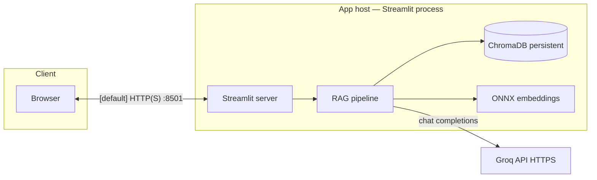

# Server architecture

This document defines the logical and physical server shape for the Climate Academy chatbot shipped in `climate_streamlit/app.py`.

## Logical components

| Component | Role | Location / provider |
|-----------|------|---------------------|
| **Streamlit runtime** | Serves the web UI, executes Python callbacks, renders components (including iframe book viewer). | Same host as `streamlit run` |
| **RAG indexer & retriever** | Chunking (`html_sectioning`), embedding, and similarity search over book paragraphs. | In-process Python |
| **Embedding model** | `ONNXMiniLM_L6_V2` via Chroma embedding utilities (`all-MiniLM-L6-v2` ONNX). Runs locally | In-process / on-disk ONNX weights (downloaded/cached by dependencies on first use) |
| **Vector store** | Chroma persistent client backing paragraph chunks and vectors. | Directory `chroma_db/` at repository root (`CHROMA_DIR`) |
| **LLM inference** | Answer generation over retrieved chunks. | [Groq](https://groq.com) API, model `llama-3.3-70b-versatile` |
| **Ground-truth content** | HTML book (required) and PDF (optional PDF→page mapping). | `input/full_student_book.html`, `input/2025_10/climate_academy_book.pdf` |

Secrets: `GROQ_API_KEY` is read from the process environment or Streamlit secrets (`st.secrets`).

## Request and data flow

1. The **browser** loads the Streamlit app and sends user input to the Streamlit server (default port **8501** unless configured).
2. **Retrieval**: the app embeds the query locally, queries Chroma, and assembles prompt context from HTML chunks.
3. **Generation**: the app calls **Groq** over HTTPS with the API key; responses are shown in the UI.

## Network boundaries and egress

- **Ingress**: operators typically expose only the Streamlit HTTP port (or place a reverse proxy in front with TLS termination).
- **Egress**:
  - **Required for chat**: HTTPS to Groq (`api.groq.com` and related endpoints used by the official Groq client).
  - **Possible on first run / model use**: downloads for embedding model weights or Hugging Face–related assets, depending on how `sentence-transformers` / Chroma resolve ONNX files (treat the app host as needing outbound HTTPS to the public internet during setup and updates).

No database server is required beyond Chroma’s **local persistent store** (files under `chroma_db/`).

## Process model

- **Single primary process**: one Streamlit server runs the whole stack (UI + RAG + Chroma client). There is no separate API microservice in this repository.
- **Scaling**: horizontal scaling would mean **multiple independent instances**, each with its own `chroma_db` copy (or shared read-only volume if you guarantee no concurrent writers). Groq calls are per-instance.

## Filesystem layout the server must provide

Relative to repository root (`ROOT_DIR = parent of climate_streamlit/`):

| Path | Purpose |
|------|---------|
| `climate_streamlit/` | Application code (`app.py`, `html_sectioning.py`) |
| `input/full_student_book.html` | Required source text for indexing and UI |
| `input/2025_10/climate_academy_book.pdf` | Optional, for precise PDF anchors |
| `chroma_db/` | Persistent Chroma database (created/updated at runtime) |

If these paths move, update `HTML_PATH`, `PDF_PATH`, and/or `CHROMA_DIR` in `app.py` or mount equivalent directories at those paths.

## Security and reliability notes

- **API key**: protect `GROQ_API_KEY` as a secret (environment variable or `.streamlit/secrets.toml`; prefer env + secret manager in production, not committed files).
- **Multi-user**: Streamlit sessions are isolated by session state; concurrent users share one Python process unless you deploy multiple replicas behind a load balancer.
- **Rate limits**: Groq may throttle or error under load; the app surfaces key-related errors in the UI.
- **Rebuild index**: deleting `chroma_db/` forces re-embedding on next startup (CPU/time cost).

This architecture is intentionally **simple**: suitable for departmental servers, VMs, containers, or managed platforms that can run a long-lived Python web process and persist a directory.
